Little moments that made me pause :)

    <figure style="text-align: center; margin: 0;">
        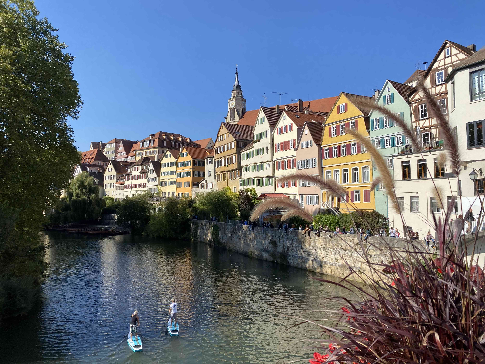
        <figcaption>Tübingen, Germany</figcaption>
    </figure>
    <figure style="text-align: center; margin: 0;">
        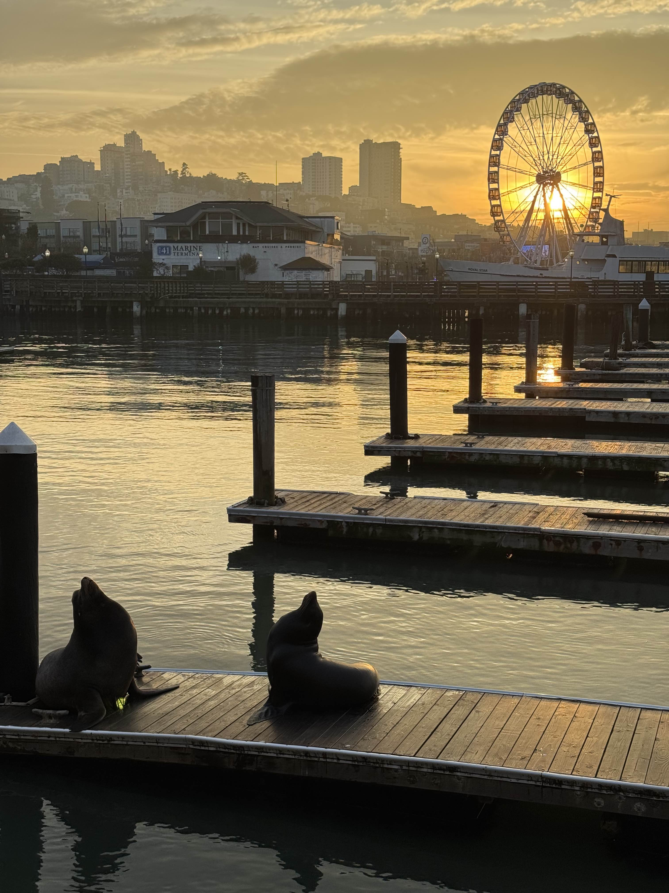
        <figcaption>San Francisco, US</figcaption>
    </figure>

    <figure style="text-align: center; margin: 0;">
        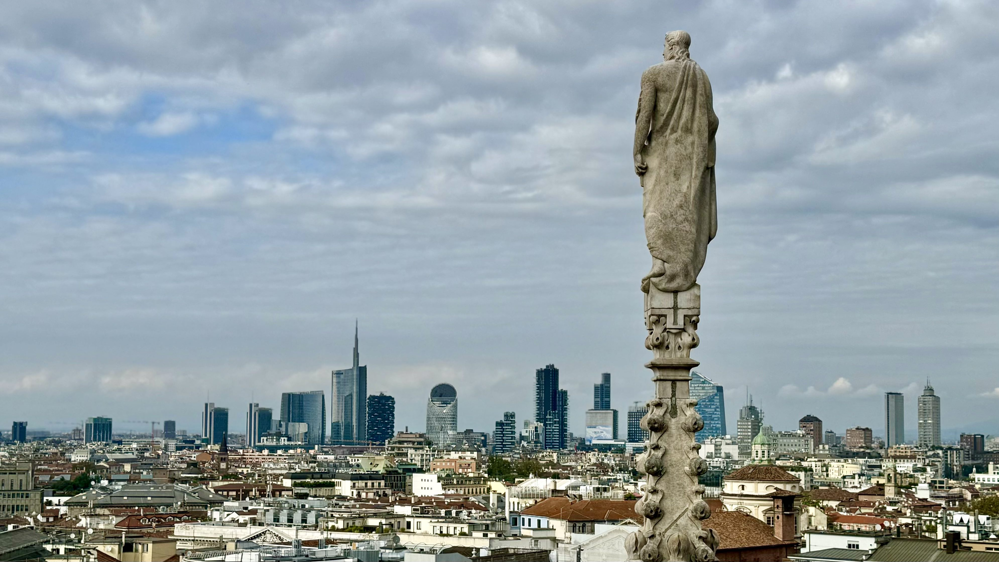
        <figcaption>Milan, Italy</figcaption>
    </figure>
    <figure style="text-align: center; margin: 0;">
        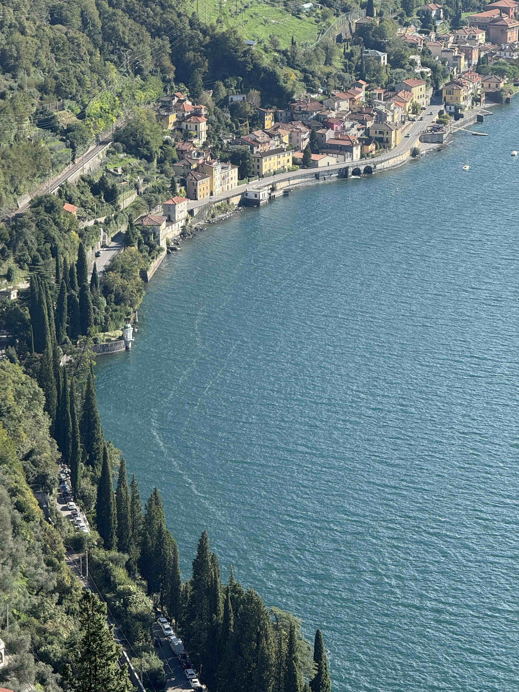
        <figcaption>Lake Como, Italy</figcaption>
    </figure>
    <figure style="text-align: center; margin: 0;">
        
        <figcaption>(Mini)Naples, Not Italy, Hamburg Miniatur Wunderland</figcaption>
    </figure>

    <figure style="text-align: center; margin: 0;">
        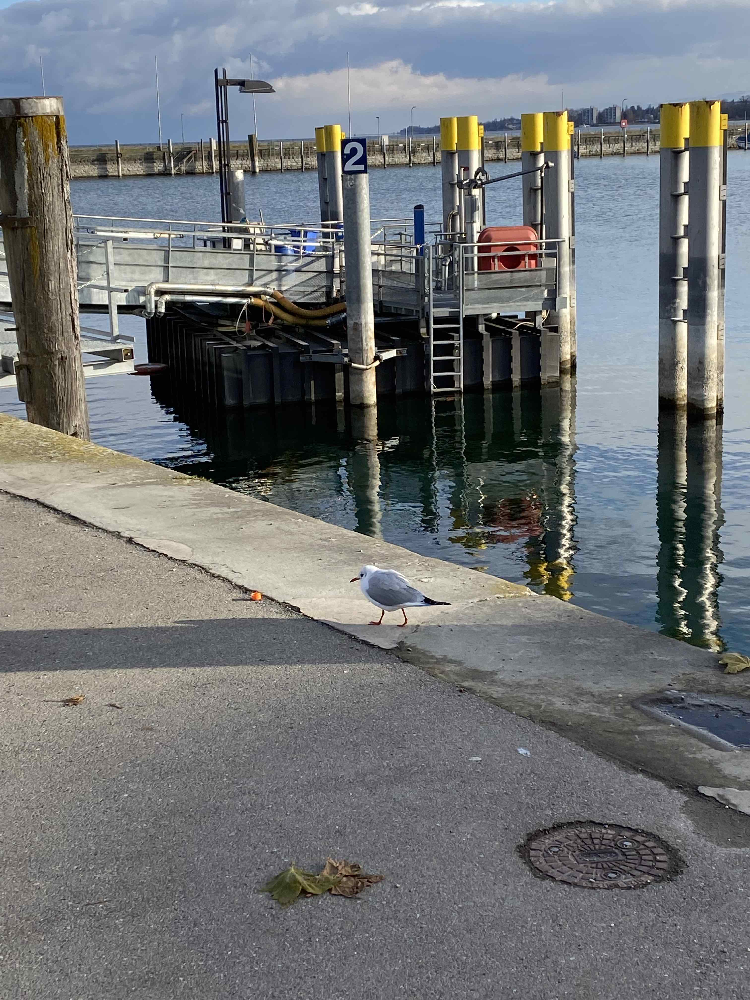
        <figcaption>Konstanz, Germany</figcaption>
    </figure>
    <figure style="text-align: center; margin: 0;">
        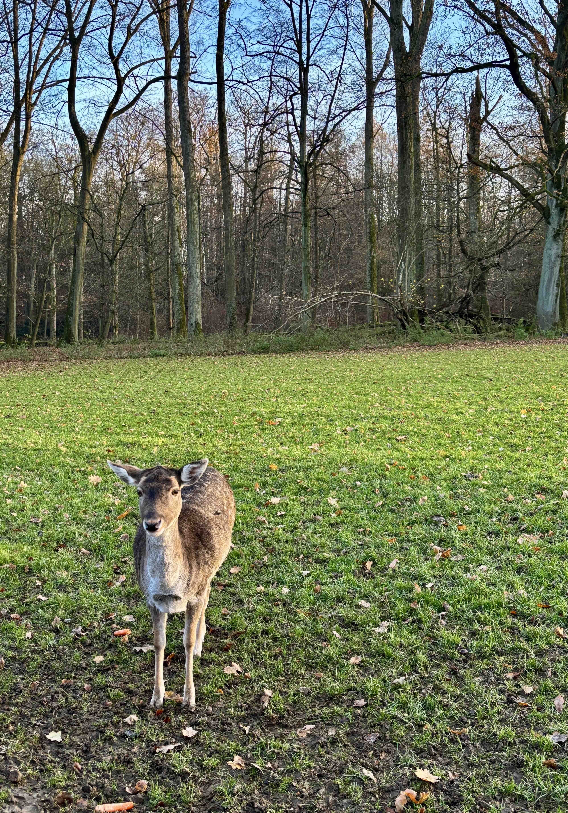
        <figcaption>Düsseldorf, Germany</figcaption>
    </figure>
    <figure style="text-align: center; margin: 0;">
        
        <figcaption>Hamilton, Hamburg, Germany (Yes, it's all in German. Yes, the rap still slaps ;)</figcaption>
    </figure>

    <figure style="text-align: center; margin: 0;">
        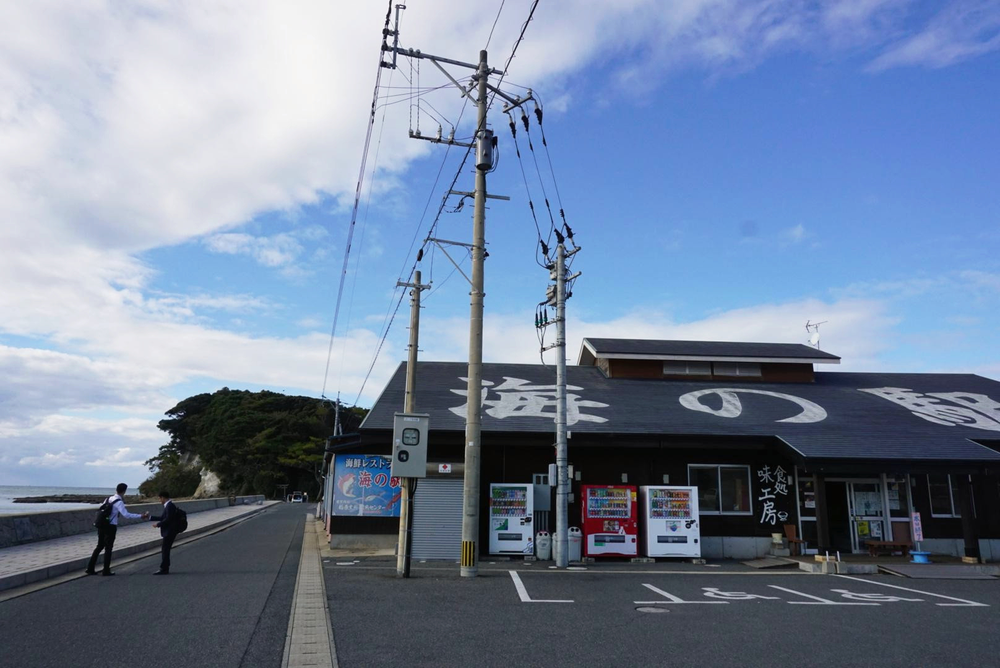
        <figcaption>Shinjuku, Japan</figcaption>
    </figure>
    <figure style="text-align: center; margin: 0;">
        
        <figcaption>Shenyang, China</figcaption>
    </figure>

    <figure style="text-align: center; margin: 0;">
        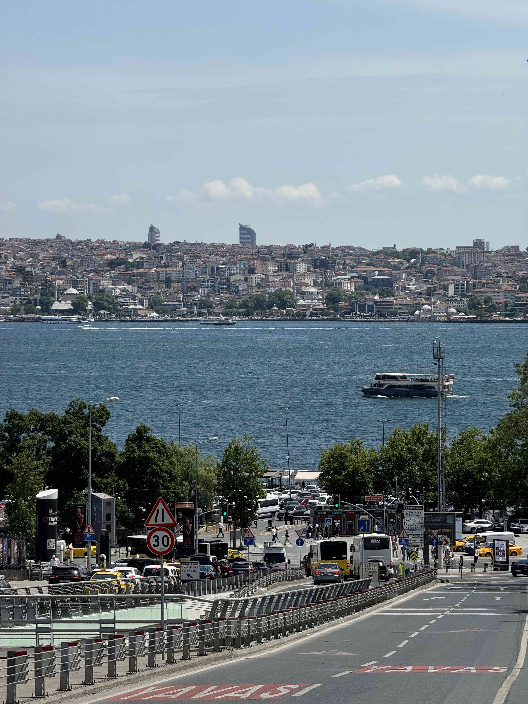
        <figcaption>Istanbul, Turkey</figcaption>
    </figure>
    <figure style="text-align: center; margin: 0;">
        
        <figcaption>Jerusalem, Israel</figcaption>
    </figure>
    <figure style="text-align: center; margin: 0;">
        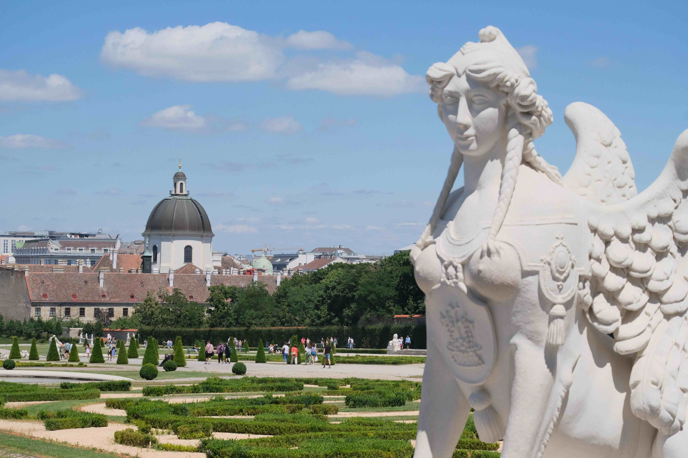
        <figcaption>Vienna, Austria</figcaption>
    </figure>

    <figure style="text-align: center; margin: 0;">
        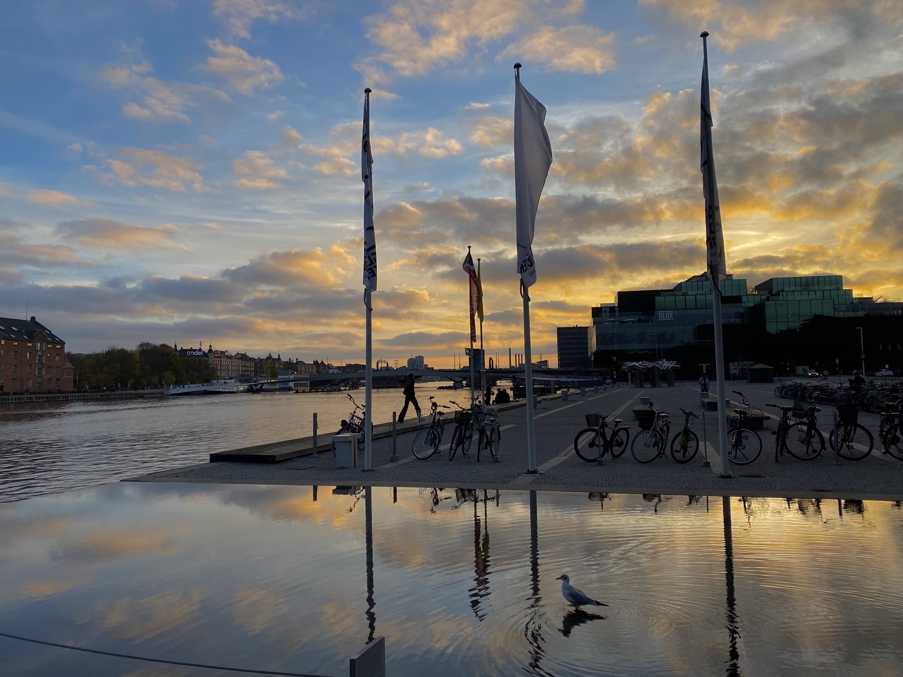
        <figcaption>Copenhagen, Denmark</figcaption>
    </figure>
    <figure style="text-align: center; margin: 0;">
        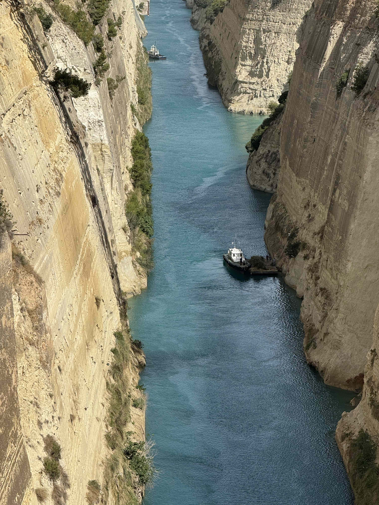
        <figcaption>Corinth Canal, Greece</figcaption>
    </figure>
    <figure style="text-align: center; margin: 0;">
        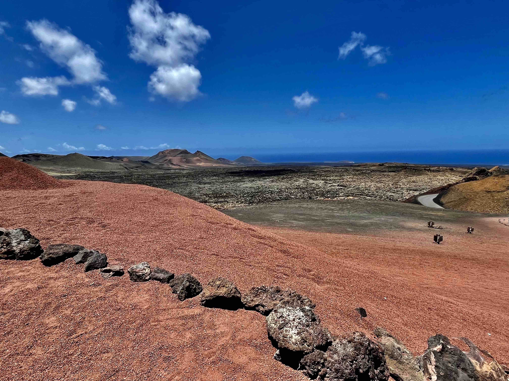
        <figcaption>Gran Canaria, Spain</figcaption>
    </figure>

<!-- 

    <figure style="text-align: center; margin: 0;">
        
        <figcaption>Datong, Shanxi, China</figcaption>
    </figure>
    <figure style="text-align: center; margin: 0;">
        
        <figcaption>Beach at sunset 2</figcaption>
    </figure>
    <figure style="text-align: center; margin: 0;">
        
        <figcaption>Beach at sunset 3</figcaption>
    </figure>

 -->
<!-- 

    As you can tell from the image quality they are taken decades ago.

 -->