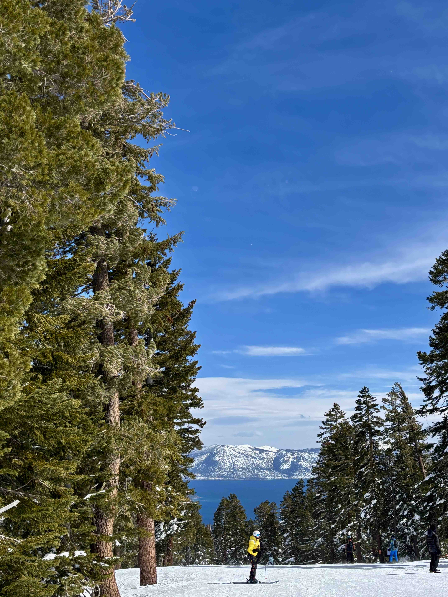

    <figure style="text-align: center; margin: 0;">
        
        <figcaption>Somewhere on the road</figcaption>
    </figure>
    <figure style="text-align: center; margin: 0;">
        
        <figcaption>Val Thorens, France</figcaption>
    </figure>

    <figure style="text-align: center; margin: 0;">
        
        <figcaption>Snowstorm in Feldberg, Germany</figcaption>
    </figure>
    <figure style="text-align: center; margin: 0;">
        
        <figcaption>Lake Tahoe, US</figcaption>
    </figure>

    <figure style="text-align: center; margin: 0;">
        
        <figcaption>Saint Anton, Austria</figcaption>
    </figure>
    <figure style="text-align: center; margin: 0;">
        
        <figcaption>Chamonix, France</figcaption>
    </figure>

    <figure style="text-align: center; margin: 0;">
        
        <figcaption>La Plagne, France</figcaption>
    </figure>

